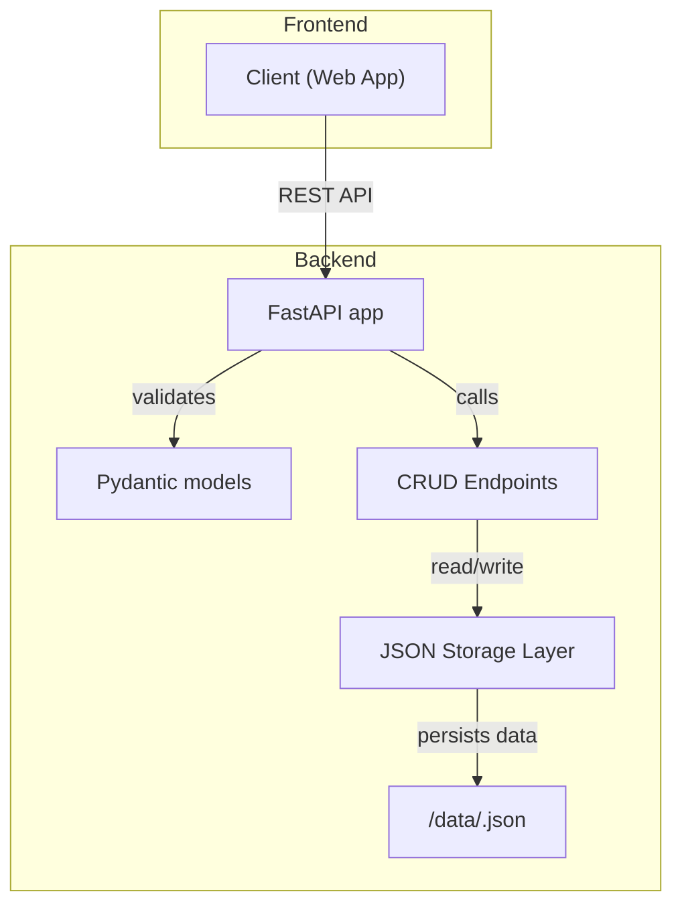

# Backend Architecture Analysis & Migration Plan: JSON Persistence

## Overview

The backend for the Employee Activity and Management System uses FastAPI to expose its RESTful API. This backend is responsible for authentication, business logic, workflow automation, and acts as the primary data source for the frontend application. The immediate task is to analyze the codebase, highlight dummy or in-memory data locations, and prepare a migration plan toward backend-only JSON file persistence, ensuring all production data is stored and managed exclusively via the backend.

---

## Current Codebase Structure

### Directory Layout

```
backend/
  ├── post_process_status.lock
  ├── requirements.txt
  └── src/
      └── api/
          ├── __init__.py
          ├── generate_openapi.py
          └── main.py
```

### Main Backend File: `src/api/main.py`

- Sets up the FastAPI app.
- Configures CORS for all origins (development-friendly).
- Defines one endpoint (GET `/`) as a health check, returning `{"message": "Healthy"}`.
- No business logic, dummy data, or data persistence operations are present.

### Supporting File: `src/api/generate_openapi.py`

- Imports the FastAPI app and generates the OpenAPI specification as `openapi.json`.
- Does not contain business logic or data.

---

## **Dummy Data Usage & Data Storage**

**Observations:**
- No dummy data usage or in-memory structures (such as lists or dictionaries) representing employees, logs, leave requests, or any relevant entities appear in the current backend source files.
- There is no persistent storage (database integration or file-based JSON operations) implemented.
- The backend is currently a skeleton ready for feature addition; the business logic, endpoints, and data are yet to be implemented.

---

## **Areas That Will Change for JSON File Persistence**

1. **API Expansion and Data Models**
   - Define Pydantic models in the backend for all key entities:
     - Employee records (including roles and hierarchy)
     - Work logs
     - Leave requests
     - Feedback, Audit trail, Settings, etc.

2. **CRUD Endpoints**
   - Implement RESTful endpoints for all operations: Create/Read/Update/Delete employees, work logs, leave requests, etc.
   - Each endpoint will interact exclusively with the backend rather than placeholder data on the frontend.

3. **JSON Storage Layer**
   - Centralize all data in `.json` files (one or several, organized by entity type).
   - Implement robust read/write functions to:
     - Load data from JSON files at each operation.
     - Write changes back atomically (using file locks if concurrency required).
     - Ensure data consistency and error handling.

4. **Dummy Data/Placeholder Removal**
   - Remove any future or accidental addition of dummy data structures from the API (none currently present).
   - Ensure all data manipulation goes through the JSON storage functions.

5. **Frontend Adaptation**
   - Although outside the immediate scope, the frontend will need to remove its placeholder data and rely entirely on these new backend endpoints for all content.

---

## **Summary Table: Required Backend Additions/Modifications**

| Location to Change                                   | Reason                                               |
|------------------------------------------------------|------------------------------------------------------|
| `src/api/main.py` + new endpoint modules             | Add REST endpoints for business entities             |
| `src/api/` (new: `models.py`, `storage.py`, etc.)    | Add data models & JSON persistence layer             |
| `src/api/main.py`                                    | Remove future/accidental placeholder/dummy structures |
| New: `/data/*.json` (directory for JSON files)       | Persist production data in JSON                      |

---

## **High-Level Migration Plan**

1. **Design Data Models**  
   Define all required Pydantic models for employees, logs, leave, audit trails, etc.

2. **Storage Interface**  
   Implement file-based functions (load/save) for each entity collection in a new module (e.g., `storage.py`), ensuring all data is stored in `/backend/data/<entity>.json`.

3. **API Layer**  
   Add endpoints for all CRUD and workflow operations, so all frontend data requests and updates are routed through the backend and use the JSON files.

4. **Production Readiness**  
   - Use file locking when writing to JSON files if concurrent clients expected.
   - Handle malformed/corrupt JSON files gracefully.
   - Validate all input via Pydantic schemas.
   - Remove or refactor any accidental dummy data usage if it appears as features are built out.

---

## **Mermaid Diagram: Planned Backend Data Flow**



---

## **Conclusion**

The backend is a clean FastAPI skeleton primed for feature development. To achieve production readiness with backend-only persistence:
- All business data (currently absent) must be modeled, routed through API endpoints, and persisted in JSON files under backend control.
- No in-memory or dummy data is present—any new business feature must use the JSON persistence approach outlined above.

### **Next Steps**
- Implement data models, persistence functions, and CRUD endpoints.
- Remove/replace any dummy or frontend placeholder data as integration proceeds.
